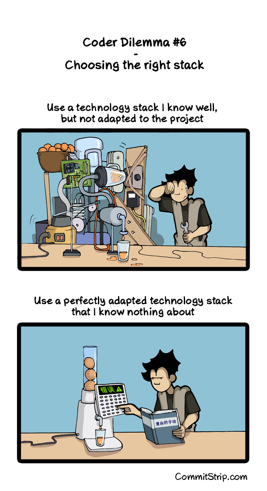

# Snake Game

This is a simple implementation of the python snake game.
Writing a snake game is an exercices I give to beginners to sensibilize them to project management and structure.
The goal is to:
* Learn some programming concepts and good practices
* Learn some python features
* Learn how to plan and structure a programming project.
* Provide examples of tools that can be used.

This code is a starting point to discuss their own implementation(s).  
There is a documentation here: [https://divad1196.github.io/snake_game_py](https://divad1196.github.io/snake_game_py)

## Structure and tools
* [Poetry](https://python-poetry.org/docs/) is a project management tool. It helps managing the dependencies, the virutal environment and creating packages.
* [Ruff](https://docs.astral.sh/ruff/) is a fast linter and formater that combine multiple tools together.
* [Mypy](https://github.com/python/mypy) is a tool to check python type hints. Typing our code is, up to some extend, a good practice that prevent lot of runtimes issues
* [Semgrep](https://github.com/semgrep/semgrep) and [checkcov](https://github.com/bridgecrewio/checkov) are security tools. They will check that the code is safe and not exposing sensitive informations
* [Pre-commit](https://pre-commit.com/) is used to run the checks automatically on the code on every commit
* The code is available on [Github](https://github.com/divad1196/snake_game_py)
* The CI is run using [Github's workflows](https://docs.github.com/en/actions/using-workflows/about-workflows). It is for example used to generate and publish the documentation.
* The documentation is generated with [PDoc](https://pdoc.dev/). I find PDoc more easy to use than Sphinx.
* The documentation is publish using [Github's pages](https://docs.github.com/en/pages/getting-started-with-github-pages/about-github-pages)

The documentation is available here: [https://divad1196.github.io/snake_game_py](https://divad1196.github.io/snake_game_py)

## Managing a project
When starting a project, we should define its limit:
* What it will do and, more importantly
* What it will not do.

Defining what a project will have defines its value, the reason why we are doing it.
This is the responsability of a Product Owner to make sure that the project has value.

On the otherside, it is easy to get lost and have nothing being accomplished because of a growing backlog.
This is the responsability of the Project Manager to make sure that the project is done in the defined deadlines.

For the statistics (1994, America):
* 30% of started projects are never finished
* 53% of the projects required 3-times the initial budget.
  NOTE: Even so, this does not mean that the project was finished.

Source: [The CHAOS Report (1994 - Standish Group International)](https://www.standishgroup.com/sample_research_files/chaos_report_1994.pdf)

## Requirements for the Snake Game

### Choosing the right tools
There are multiple reasons for your tools or "your stack":
* More suited for the job
* Contains useful tools/libraries
* Popularity: using popular tools will help with on-boarding process. Our are also more likely to find a solution to a problem.
* Already known by the team's members: This should weight more that having the perfect stack for the job. If no one can backup the selected stack, the project is mostly doomed from the start.

Your project should never be just new, trendy and hiped technologies: Any trend is bound to die one day.  
This does not mean that you cannot incorporate new technologies. Just choose wisely and be moderate.  
I would say that, ideally, 90% of the stack should be known/popular/battle-tested/production-ready stack, against 10% of new technologies.

In this case, there are no particular requirements.
* [PyGame](https://www.pygame.org) is a good and easy library
* [Python](https://www.python.org/) is fast enought for that and really easy.
Also, the people concerned by this project are learning python.

  
Source: [The right stack](https://www.commitstrip.com/en/2015/06/30/coder-dilemma-6-choosing-the-right-stack/?)

NOTE: Go check CommitStrip's comics, it is really accurate about the life of a CS engineer!

### What are the required features ?
1. We must be able to display the snake on a graphical interface
2. The snake must start with a length of 3.
3. The snake must move periodically
4. If the snake goes out of the map, it starts back on the other side.
5. We must be able to control the snake's direction using the keyboard's arrows
6. There must always be at least one apple on the map.
7. Once the snake eats the apple, it grows and a new apple appears on the map
8. If the snakes enters in colision with himself, the game ends (the GUI closes itself) and the score is displayed in the terminal

NOTE: The feature described here are the **main** ones and are sorted.

#### Organizing and prioritizing the features
When planning a project, you must define the order in which the features will be implemented. The goals are to:
* Be able to anticipate the difficulties (I will need to do X in a few week, I can start learning about it until then)
* Influence how you write the code so you won't be block in the feature when trying to add more features.
* Be able to pipeline the work, for example:
  * Week 1: Developer A implements feature X
  * Week 2:
    * Developer A implements feature Y while
    * Developer B use feature X previously implemented by Developer A
* Regularly deliver somethings that works: It does not need to be finished. But it allows you to have faster feedbacks on your project and adapt immediately if needed. It is really important when having investors, and this sometimes implies prioritizing the features with the biggest "WOW" effect.

### What are the difficulties ?
We hopefuly don't have any deadlines here, nor budget. The difficulties are only technical:

How do you represent the snake?
There are multiple approach for this, each having their pros and cons. The final solution must allows you to:
* move the snake
* find if the snake eats the apple
* make the snake grow
* find an empty coordinate for the apple (i.e. the cell must not be occupied by a part of the snake's body)
* find if the snake enters in colision with something (himself in this case)
